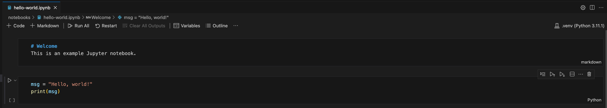

# Welcome

This project aims to explore working with [Python](https://www.python.org) and [Jupyter](https://pypi.org/project/jupyter/) notebooks.



## Getting started

### Prerequisites

Please make sure that you have the following installed on your development environment:

- [Node.js](https://nodejs.org/en)
- [Python](https://www.python.org)

This code base was initially developed and tested on:

- 2021 14" MacBook Pro
  - Apple M1 Max
  - 64 GB memory
  - 2 TB SSD
  - macOS Sonoma `14.2.1`
    - Node.js `v20.9.0`
    - npm `10.2.5`
    - Python `3.11.1`

### Scripts

This project includes several scripts to get you up and running with your local development environment using `npm` (e.g., `npm run` setup`):

- `setup`

  - This script checks to see if a Python virtual environment has been created at `.venv` and installs dependencies from [requirements.txt](./requirements.txt)

- `start`

  - This script uses the Python virtual environment at `.venv` to run the application locally

- `test`

  - This script uses the Python virtual environment at `.venv` and runs the unit tests for our shot chart application

- `test:coverage`

  - This script uses the Python virtual environment at `.venv`, runs the unit tests for our shot chart application, and generates an HTML coverage report at [./htmlcov/index.html](./htmlcov/index.html) that will automatically open in the default web browser on macOS.

- `destroy`
  - This script removes the Python virtual environment at `.venv`

## Python cheat sheet

If you're just getting started with Python, here are snippets of commands that you may find helpful to get you up and running in no time.

```sh
# Verify that you have Python installed on your machine
% python3 --version
Python 3.11.1

# Create a new virtual environment for the project
% python3 -m venv .venv

# Select your new environment by using the Python: Select Interpreter command in VS Code
#   - Enter the path: ./.venv/bin/python

# Activate your virtual environment
% source .venv/bin/activate
(.venv) %

# PREFERRED: Install the packages from requirements.txt
(.venv) % pip install -r requirements.txt

# Install Python packages in a virtual environment
# (.venv) % pip install <package_name>

# Install Python testing packages
# (.venv) % pip install pytest pytest-asyncio
# (.venv) % pip install pytest-cov

# When you are ready to generate a requirements.txt file
# (.venv) % pip freeze > requirements.txt

# Uninstall the package from your virtual environment
# (.venv) % pip uninstall simplejson

# Remove the dependency from requirements.txt if it exists
# (.venv) % pip uninstall -r requirements.txt

# To run unit tests:
# (.venv) % pytest

# To run unit tests and automatically view the HTML coverage report on macOS:
# (.venv) % pytest --cov=. --cov-report=html && open htmlcov/index.html

# To run a single unit test
# (.venv) % pytest test_something.py

# Deactivate your virtual environment
(.venv) % deactivate
% 
```
